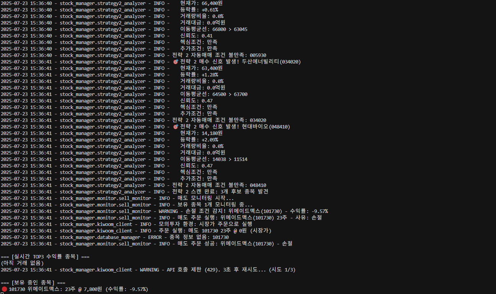

# StockManager

## Intraday Stock Trading & Backtesting System

**Author:** Zeu Park  
**Email:** parkzeu68

---

StockManager is a Python-based framework for real-time intraday trading and strategy backtesting, designed for the Korean stock market. It features event-driven backtesting, advanced analytics, and a robust real-time trading engine. This project is ideal for portfolio demonstration, showcasing both algorithmic trading and quantitative research skills.

---

## 🚀 Key Features

### 1. Real-Time Trading System
- **WebSocket-based real-time data streaming**
- **Automated order execution** based on strategy signals
- **Live risk management** (position sizing, stop-loss, trailing stop)
- **API integration** with Korea Investment & Securities

### 2. Strategy Backtesting
- **Event-driven backtesting** using 1-minute bar data
- **Multiple strategies supported** (e.g., Gap and Go, Trend Following)
- **Dynamic risk management** (trailing stop, position sizing)
- **Market regime filter** based on KOSPI index
- **Realistic trading cost modeling** (commission, tax, slippage)

### 3. Advanced Analytics
- **Walk-forward optimization** to prevent overfitting
- **Parameter sensitivity analysis**
- **Batch backtesting** for robustness
- **Performance monitoring** (real-time and historical)

---

## 📁 Project Structure

```
StockManager/
├── main.py                  # Entry point for CLI and orchestration
├── account/                 # Account monitoring and management modules
├── analysis/                # Strategy analytics, visualization, and batch analysis
├── api/                     # API clients for brokerage and data (REST, WebSocket)
├── config/                  # Project-wide configuration and settings
├── core/                    # Core trading logic, backtesting, optimization, and real-time engine
├── data_collection/         # Data collection scripts and market data utilities
├── database/                # Database schema, initialization, and management
├── deployment/              # Docker and deployment configs
├── docs/                    # Documentation, strategy guides, and flow diagrams
├── logs/                    # Log files (auto-generated)
├── minute_data/             # 1-minute bar data storage (external or generated)
├── monitor/                 # Real-time monitoring, metrics, and alerting
├── monitoring/              # Prometheus and monitoring configs
├── news_trading/            # News-based trading strategies and crawlers
├── nginx/                   # Nginx reverse proxy configuration
├── orders/                  # Order management and signal processing
├── tests/                   # Unit and integration tests
├── trading/                 # Trading simulators and strategy runners
├── utils/                   # Utility modules (indicators, logging, tokens)
└── requirements.txt         # Python dependencies
```

### Directory Descriptions

- **main.py**: Unified entry point for running backtests, real-time trading, or utilities.
- **account/**: Account monitoring, balance tracking, and account-related utilities.
- **analysis/**: Tools for analyzing strategies, visualizing results, and running batch analytics.
- **api/**: Interfaces for connecting to brokerage APIs (REST/WebSocket) and data providers.
- **config/**: Centralized configuration files and settings for the project.
- **core/**: Core trading engine, backtesting logic, parameter optimization, and real-time trading modules.
- **data_collection/**: Scripts and modules for collecting historical and real-time market data.
- **database/**: Database schema, initialization scripts, and management utilities for storing trades and analytics.
- **deployment/**: Docker and deployment-related configuration for production or cloud environments.
- **docs/**: Documentation, strategy explanations, project flowcharts, and example results.
- **logs/**: Directory for log outputs (created automatically during runs).
- **minute_data/**: Storage for 1-minute bar data (external or generated by data collectors).
- **monitor/**: Real-time monitoring scripts, Prometheus metrics exporters, and alerting tools.
- **monitoring/**: Prometheus and monitoring configuration files.
- **news_trading/**: News-based trading strategies, crawlers, and related backtesting tools.
- **nginx/**: Nginx configuration for reverse proxying dashboards or APIs.
- **orders/**: Order management, signal processing, and execution logic.
- **tests/**: Unit and integration tests for all major modules.
- **trading/**: Trading simulators and strategy execution scripts.
- **utils/**: Utility functions, technical indicators, logging, and token management.
- **requirements.txt**: List of Python dependencies for the project.

---

## 🛠️ Technical Stack & Implementation Details

### 1. **Python 기반 아키텍처**
- **주 언어:** Python 3.x  
  데이터 분석, 실시간 처리, 백테스트, API 연동 등 전 영역에 활용

### 2. **실시간 데이터 처리**
- **WebSocket 클라이언트:**  
  실시간 시세 데이터 수신 및 이벤트 기반 트레이딩 신호 처리  
  `api/websocket_client.py`에서 비동기 WebSocket 통신 구현
- **REST API 연동:**  
  증권사 API(예: 한국투자증권)와의 통신을 위한 REST 클라이언트  
  주문, 잔고조회, 체결내역 등 실시간/비실시간 데이터 처리

### 3. **이벤트 기반 트레이딩 엔진**
- **Event-driven Architecture:**  
  실시간 데이터 수신 → 신호 생성 → 주문 실행 → 포지션 관리의 일련의 흐름을 이벤트로 처리  
  `core/real_time_trading.py` 등에서 구현

### 4. **전략 백테스팅 및 최적화**
- **1분봉 데이터 기반 백테스트:**  
  `core/backtest_gradual_riser.py` 등에서 1분 단위로 전략 성과 평가
- **Walk-forward Optimization:**  
  과최적화 방지를 위한 구간별 최적화 및 검증  
  `core/parameter_optimizer.py`에서 구현
- **Batch Backtesting:**  
  다양한 파라미터/전략 조합을 반복적으로 평가

### 5. **고급 분석 및 시각화**
- **전략 성과 분석:**  
  수익률, MDD, 샤프지수 등 다양한 지표 산출  
  `analysis/analysis_visualizer.py` 등에서 시각화 지원
- **파라미터 민감도 분석:**  
  전략 파라미터 변화에 따른 성과 민감도 분석

### 6. **리스크 및 포지션 관리**
- **자동 포지션 사이징, 손절/익절, 트레일링 스탑**  
  실시간 및 백테스트 모두에서 적용
- **시장 필터링:**  
  KOSPI 등 시장지수 기반 매매 필터링

### 7. **데이터 수집 및 관리**
- **자동 데이터 수집 스크립트:**  
  `data_collection/` 내 다양한 수집기
- **DB 관리:**  
  SQLite 등 경량 DB를 통한 거래/분석 데이터 저장  
  `database/` 내 스키마 및 초기화 스크립트

### 8. **모듈화 및 확장성**
- **폴더별 역할 분리:**  
  전략, 데이터, 주문, 모니터링, 유틸리티 등 기능별 디렉터리 구조
- **유닛/통합 테스트:**  
  `tests/` 내 주요 기능별 테스트 코드

### 9. **운영 및 배포**
- **Docker 기반 배포:**  
  `deployment/` 내 Dockerfile, docker-compose로 손쉬운 환경 구축
- **Nginx Reverse Proxy:**  
  대시보드/모니터링 서비스 프록시 지원

### 10. **모니터링 및 로깅**
- **Prometheus Metrics Exporter:**  
  실시간 지표 수집 및 외부 모니터링 연동
- **로깅 시스템:**  
  `utils/logger.py` 등에서 로그 관리

---

## 🛠️ Installation

1. **Clone the repository:**
```bash
git clone https://github.com/yourusername/StockManager.git
cd StockManager
```

2. **Install dependencies:**
```bash
pip install -r requirements.txt
```

3. **Prepare data:**
- Collect 1-minute bar data and KOSPI index data using provided scripts in `data_collection/`.

4. **Configure API (for live trading):**
- Edit `api_config.json` with your API credentials.

---

## 📊 Usage Examples

### 1. Run a Basic Backtest
```bash
python backtest_gradual_riser.py
```

### 2. Batch Backtesting
```bash
python multi_experiment.py --repeat 10
```

### 3. Walk-Forward Optimization
```bash
python parameter_optimizer.py --walk-forward
```

### 4. Real-Time Trading
```bash
python core/real_time_trading.py
```

---

## 📈 Example Results

### Backtest Performance Graph


### Real-Time Trading Dashboard (Sample)


*If you need actual result images, place your PNG/JPG files in the `docs/` folder and update the links above.*

---

## 🧠 Strategies Overview

### Gap and Go
- **Goal:** Capture early-morning momentum from opening price gaps and volume spikes
- **Logic:**
  - Opening gap > 0.2%
  - Volume > 30,000 shares at 9:00
  - Below 20-day moving average at open

### Trend Following
- **Goal:** Enter after intraday trend is established
- **Logic:**
  - Price up > 1% from open
  - MA5 > MA20 (golden cross)
  - Volume ratio > 80%

---

## ⚙️ Configuration Example

Edit `config/settings.py` for key parameters:
```python
CONFIG = {
    'initial_capital': 10000000,  # Starting capital (KRW)
    'max_positions': 2,           # Max concurrent positions
    'position_size': 1000000,     # Per-position size
    'stop_loss': -2.0,            # Stop loss (%)
    'take_profit': 5.0,           # Take profit (%)
    'trailing_stop': 3.0,         # Trailing stop (%)
    'commission_rate': 0.015,     # Commission (%)
    'tax_rate': 0.18,             # Tax (%)
    'slippage_rate': 0.05,        # Slippage (%)
    'enable_market_filter': True, # Use market regime filter
}
```

---

## 🧪 Testing

Run all tests:
```bash
pytest tests/
```

---

## 📚 Documentation
- Each module and function includes docstrings for clarity.
- See `docs/` for strategy explanations and checklists.

---

## 📝 License

This project is licensed under the MIT License.

---

## 📬 Contact

For questions or collaboration, contact:
- **Name:** Zeu Park
- **Email:** parkzeu68

---

**⚠️ Disclaimer:** This system is for educational and research purposes only. Use at your own risk. Always validate strategies thoroughly before live trading. 