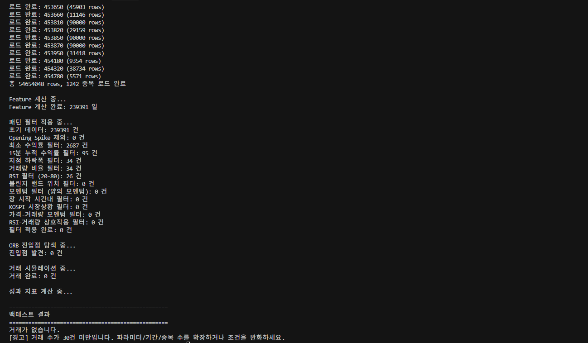

# StockManager

## Intraday Stock Trading & Backtesting System

**Author:** Zeu Park  
**Email:** parkzeu68

---

StockManager is a Python-based framework for real-time intraday trading and strategy backtesting, designed for the Korean stock market. It features event-driven backtesting, advanced analytics, and a robust real-time trading engine. This project is ideal for portfolio demonstration, showcasing both algorithmic trading and quantitative research skills.

---

## 🚀 Key Features

### 1. Real-Time Trading System
- **WebSocket-based real-time data streaming**
- **Automated order execution** based on strategy signals
- **Live risk management** (position sizing, stop-loss, trailing stop)
- **API integration** with Korea Investment & Securities

### 2. Strategy Backtesting
- **Event-driven backtesting** using 1-minute bar data
- **Multiple strategies supported** (e.g., Gap and Go, Trend Following)
- **Dynamic risk management** (trailing stop, position sizing)
- **Market regime filter** based on KOSPI index
- **Realistic trading cost modeling** (commission, tax, slippage)

### 3. Advanced Analytics
- **Walk-forward optimization** to prevent overfitting
- **Parameter sensitivity analysis**
- **Batch backtesting** for robustness
- **Performance monitoring** (real-time and historical)

---

## 📁 Project Structure

```
StockManager/
├── main.py                  # Entry point
├── core/                    # Core trading & real-time modules
├── analysis/                # Strategy analysis & analytics
├── api/                     # API clients (REST, WebSocket)
├── orders/                  # Order & signal management
├── database/                # Database management
├── config/                  # Settings & configuration
├── utils/                   # Utilities (indicators, logging, tokens)
├── tests/                   # Unit & integration tests
└── ...
```

---

## 🛠️ Installation

1. **Clone the repository:**
```bash
git clone https://github.com/yourusername/StockManager.git
cd StockManager
```

2. **Install dependencies:**
```bash
pip install -r requirements.txt
```

3. **Prepare data:**
- Collect 1-minute bar data and KOSPI index data using provided scripts in `data_collection/`.

4. **Configure API (for live trading):**
- Edit `api_config.json` with your API credentials.

---

## 📊 Usage Examples

### 1. Run a Basic Backtest
```bash
python backtest_gradual_riser.py
```

### 2. Batch Backtesting
```bash
python multi_experiment.py --repeat 10
```

### 3. Walk-Forward Optimization
```bash
python parameter_optimizer.py --walk-forward
```

### 4. Real-Time Trading
```bash
python core/real_time_trading.py
```

---

## 📈 Example Results

### Backtest Performance Graph


### Real-Time Trading Dashboard (Sample)


*If you need actual result images, place your PNG/JPG files in the `docs/` folder and update the links above.*

---

## 🧠 Strategies Overview

### Gap and Go
- **Goal:** Capture early-morning momentum from opening price gaps and volume spikes
- **Logic:**
  - Opening gap > 0.2%
  - Volume > 30,000 shares at 9:00
  - Below 20-day moving average at open

### Trend Following
- **Goal:** Enter after intraday trend is established
- **Logic:**
  - Price up > 1% from open
  - MA5 > MA20 (golden cross)
  - Volume ratio > 80%

---

## ⚙️ Configuration Example

Edit `config/settings.py` for key parameters:
```python
CONFIG = {
    'initial_capital': 10000000,  # Starting capital (KRW)
    'max_positions': 2,           # Max concurrent positions
    'position_size': 1000000,     # Per-position size
    'stop_loss': -2.0,            # Stop loss (%)
    'take_profit': 5.0,           # Take profit (%)
    'trailing_stop': 3.0,         # Trailing stop (%)
    'commission_rate': 0.015,     # Commission (%)
    'tax_rate': 0.18,             # Tax (%)
    'slippage_rate': 0.05,        # Slippage (%)
    'enable_market_filter': True, # Use market regime filter
}
```

---

## 🧪 Testing

Run all tests:
```bash
pytest tests/
```

---

## 📚 Documentation
- Each module and function includes docstrings for clarity.
- See `docs/` for strategy explanations and checklists.

---

## 📝 License

This project is licensed under the MIT License.

---

## 📬 Contact

For questions or collaboration, contact:
- **Name:** Zeu Park
- **Email:** parkzeu68

---

**⚠️ Disclaimer:** This system is for educational and research purposes only. Use at your own risk. Always validate strategies thoroughly before live trading. 